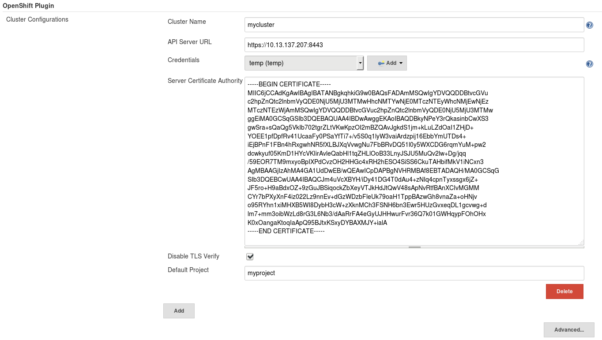
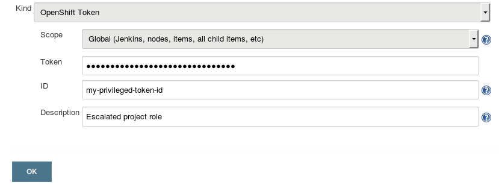
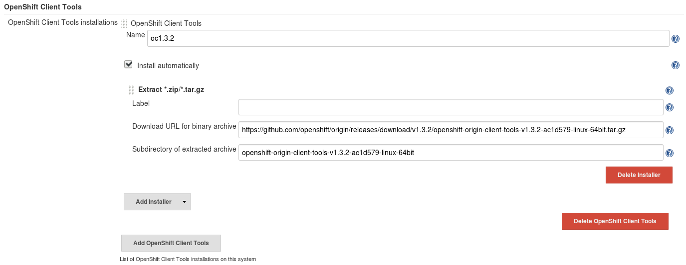
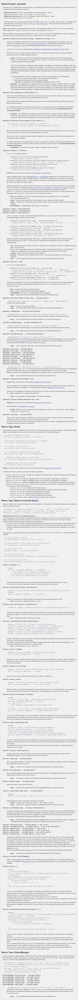

# OpenShift Jenkins Pipeline (DSL) Plugin

<!-- Install doctoc with `npm install -g doctoc`  then `doctoc README.md --github` -->
<!-- START doctoc generated TOC please keep comment here to allow auto update -->
<!-- DON'T EDIT THIS SECTION, INSTEAD RE-RUN doctoc TO UPDATE -->


- [Overview](#overview)
- [Reader Prerequisites](#reader-prerequisites)
- [Installing and developing](#installing-and-developing)
- [Compatibility with Declarative Pipeline](#compatibility-with-declarative-pipeline)
- [Compatibility with parallel step](#compatibility-with-parallel-step)
- [Compatibility with load step](#compatibility-with-load-step)
- [Examples](#examples)
  - [Hello, World](#hello-world)
  - [Centralizing Cluster Configuration](#centralizing-cluster-configuration)
  - [Sticking with the defaults](#sticking-with-the-defaults)
  - [Introduction to Selectors](#introduction-to-selectors)
  - [Actions speak louder than words](#actions-speak-louder-than-words)
  - [Peer inside of OpenShift objects](#peer-inside-of-openshift-objects)
  - [Watching and waiting? Of course!](#watching-and-waiting-of-course)
  - [Looking to Verify a Deployment or Service? We Can Still Do That!](#looking-to-verify-a-deployment-or-service-we-can-still-do-that)
  - [ImageStream SCMs? Use Pipeline Build Strategy and Image Change Triggers instead.](#imagestream-scms-use-pipeline-build-strategy-and-image-change-triggers-instead)
  - [Deleting objects. Easy.](#deleting-objects-easy)
  - [Creating objects. Easier than you were expecting... hopefully.](#creating-objects-easier-than-you-were-expecting-hopefully)
  - [Need to update an object without replacing it?](#need-to-update-an-object-without-replacing-it)
  - [Cannot live without OpenShift templates? No problem.](#cannot-live-without-openshift-templates-no-problem)
  - [Want to promote or migrate objects between environments?](#want-to-promote-or-migrate-objects-between-environments)
  - [Error handling](#error-handling)
  - [Troubleshooting](#troubleshooting)
  - [Who are you, really?](#who-are-you-really)
  - [I need more.](#i-need-more)
- [Configuring an OpenShift Cluster](#configuring-an-openshift-cluster)
- [Setting up Credentials](#setting-up-credentials)
- [Setting up Jenkins Nodes](#setting-up-jenkins-nodes)
- [Moving Images Cluster to Cluster](#moving-images-cluster-to-cluster)
- [You call this documentation?!](#you-call-this-documentation)

<!-- END doctoc generated TOC please keep comment here to allow auto update -->

## Overview
The [OpenShift](https://www.openshift.com) [Pipeline](https://jenkins.io/solutions/pipeline/)
DSL Plugin is a Jenkins plugin which aims to provide a readable, concise, comprehensive, and fluent
[Jenkins Pipeline](https://jenkins.io/doc/book/pipeline/) syntax for rich interactions with an OpenShift API Server. The
plugin leverages an OpenShift command line tool (oc) which must be available on the nodes executing the script
(options for getting the binary on your nodes can be found [here](#setting-up-jenkins-nodes)).

Starting with the 3.7 release of OpenShift, this plugin is now considered GA, is fully supported, and is included
in the OpenShift Jenkins images. 

If you are interested in the legacy Jenkins plugin, you can find it
[here](https://github.com/openshift/jenkins-plugin).

## Reader Prerequisites
* Familiarity with OpenShift [command line interface](https://docs.openshift.org/latest/cli_reference/basic_cli_operations.html)
is highly encouraged before exploring the plugin's features. The DSL leverages the [oc](https://docs.openshift.org/latest/cli_reference/index.html)
binary and, in many cases, passes method arguments directly on to the command line. This document cannot, therefore,
provide a complete description of all possible OpenShift interactions -- the user may need to reference
the CLI documentation to find the pass-through arguments a given interaction requires.
* A fundamental level of understanding of the Jenkins [Pipeline](https://jenkins.io/solutions/pipeline/) architecture and
[basic pipeline steps](https://jenkins.io/doc/pipeline/steps/workflow-basic-steps/) may be required to appreciate
the remainder of this document. Readers may also find it useful to understand basic [Groovy syntax](http://groovy-lang.org/syntax.html),
since pipeline scripts are written using Groovy (Note: Jenkins sandboxes and [interferes](https://issues.jenkins-ci.org/browse/JENKINS-26481)
with the use of some Groovy facilities).

## Installing and developing
This plugin is available at the [Jenkins Update Center](https://updates.jenkins-ci.org/download/plugins/openshift-client/) and is included
in the [OpenShift Jenkins image.](https://github.com/openshift/jenkins)

Otherwise, if you are interested in building this plugin locally, follow these steps:

1. Install maven (platform specific)
2. Clone this git repository:
    ```
    git clone https://github.com/openshift/jenkins-client-plugin.git
    ```
3. In the root of the local repository, run maven
    ```
    cd jenkins-client-plugin
    mvn clean package
    ```
4. Maven will build target/openshift-client.hpi  (the Jenkins plugin binary)
5. Open Jenkins in your browser, and navigate (as an administrator):
  1. Manage Jenkins > Manage Plugins.
  2. Select the "Advanced" Tab.
  3. Find the "Upload Plugin" HTML form and click "Browse".
  4. Find the openshift-client.hpi built in the previous steps.
  5. Submit the file.
  6. Check that Jenkins should be restarted.

You should now be able to [configure an OpenShift Cluster](#configuring-an-openshift-cluster).
Before running a job, you may also need to ensure your Jenkins nodes [have the 'oc' binary](#setting-up-jenkins-nodes)
installed.  And for Linux users, there can be [some additional requirements](https://docs.openshift.org/latest/cli_reference/get_started_cli.html#cli-linux) for running 'oc' based on which Linux distribution you are using.

If you want to test your changes against a running OpenShift server using the regression test suite located 
in the OpenShift Origin repository, see [these instructions.](https://github.com/openshift/jenkins-client-plugin/blob/master/PR-Testing/README)

## Compatibility with Declarative Pipeline

The means by which this plugin has been able to coexist with [declarative pipeline](https://jenkins.io/doc/book/pipeline/syntax/#declarative-pipeline)
has taken a few twists and turns since v1.0 of that feature first arrived in [early 2017](https://jenkins.io/blog/2017/02/03/declarative-pipeline-ga/).

In particular, the recommendation around leveraging this plugin's directives with the declarative `pipeline { ... }` directive have 
had to be adjusted as the [pipeline-model-definition plugin](https://github.com/jenkinsci/pipeline-model-definition-plugin) has evolved.

Currently, there are two requirements of note:

1. Per the requirements of declarative pipelines, the

```groovy
pipeline {

...

}
```

directive must be the outer most closure to fully enable all the declarative pipeline semantics and features.

2. Declarative currently does not support groovy body/closures that are not pipeline script steps.  And since 
this plugin integrates into Jenkins as a Global Variable, it does not meet that restriction.  As such, you must 
encapsulate all use of this plugin with the declarative

```groovy
script {

...

}
```

directive such that the declarative interpreter is told to treat this as scripted pipeline.

In fact, per https://issues.jenkins-ci.org/browse/JENKINS-42360 this situation has been discussed upstream and it is stated that this restrictions between declarative and global variables will not be lifted. 

As development of this plugin continues, periodic attempts will be made to monitor that these recommendations 
are still valid, and if not, either adjust recommendations accordingly, or leverage any new integration points 
with declarative that are synergistic with this plugin's design.  

But certainly if users of this plugin notice changes before the maintainers of the plugin, please advise via opening issues at 
https://github.com/openshift/jenkins-client-plugin.

## Compatibility with parallel step

As this plugin is implemented as a Jenkins Global Variable, then its step name, `openshift`, is, as a 
Global Variable implies, a singleton within the context of a job run.  This aspect has ramifications when
employing `openshift.withCluster(...)` within the `parallel` step's closure, as `openshift.withCluster` (and the
`openshift.withProject` or `openshift.withCredentials` calls that can occur within a `openshift.withCluster` closure) modifies the 
state of the `openshift` global variable for a pipeline run.  

The current version of groovy in Jenkins, as well as the lack of API for Global Variables to interpret that they
are running within the context of a given `parallel` closure, prevent this plugin from managing `withCluster`, 
`withProject`, or `withCredentials` calls in parallel.

As such, any use of the `parallel` step must be within the inner most closure of whatever combination of 
`openshift.withCluster`, `openshift.withProject`, and `openshift.withCredentials` your pipeline employs

```groovy
openshift.withCluster() {
   openshift.withProject() {
      parallel {
      ...
      }
   }
}
```

NOTE: while the more recent pipeline documentation discusses `parallel` as part of the Declarative Syntax, at least 
at the time of this writing, it was still provided as part of the workflow-cps plugin (i.e. the original Scripted Syntax).
If that were to change, and `parallel` were only available via the Declarative Syntax, then the above restrictions regarding
Declarative Syntax would apply.

If you cannot prevent `openshift.withCluster` from being called from within a `parallel` block, the `openshift.setLockName` method 
can be called prior `openshift.withCluster` to denote a lock resource to be processed by the pipeline `lock` step provided
by the [Lockable Resources plugin](https://jenkins.io/doc/pipeline/steps/lockable-resources/). This plugin is included in the 
OpenShift Jenkins image.  But if you are running Jenkins outside of the OpenShift Jenkins image, you need to have that plugin 
installed in order to leverage this integration.

An example usage would be

```groovy
pipeline {
    agent none
    stages {
        stage('Test init') {
            steps {
                script {
                    openshift.setLockName(${var-name-that-ideally-includes-job-name-and-run-number})
                }
            }
        }
        stage('Run tests') {
            parallel {
                stage('Test run 1') {
                    steps {
                        script {
                            openshift.withCluster(...) {
                            ...
                            }
                        }
                    }
                }
      
                stage('Test run 2') {
                    steps {
                        script {
                            openshift.withCluster(...) {
                            ...
                            }
                        }
                    }
                }
            }
        }
    }
}

```
NOTE:  there is currently no automatic means to periodically purge any lock resources which your pipelines dynamically create.
You'll have to manage periodically purging that inventory.

## Compatibility with load step

Another integration concern, albeit dependent on the timing of Jenkins restarts, resulting from the Global Variable integration
point has been uncovered with respect to the `load` step.

Also note, these timing windows can be widened when the `input` step is used, as that can pause a pipeline run while it waits for
user confirmation.

Under the covers, the `load` step creates a new version of the internal objects the Global Variable is bounded to.  If the `openshift.withCluster`
and `openshift.withProject` calls are in separate scripts, and Jenkins is restarted, we've seen state stored by the `openshift.withCluster` call
lost as the pipeline run is read back into the system after the restart completes.  The state is not lost if a restart does not occur.

We'll illustrate with a user provided example.  First, here is some of this plugin's DSL stored in a Groovy method within a `deploy.groovy` file:

```groovy
def execute(String env) {
                openshift.withProject(env) {
                    openshift.selector("dc", "simple-python").rollout().latest()
                    def latestDeploymentVersion = openshift.selector('dc',"simple-python").object().status.latestVersion
                    def rc = openshift.selector('rc', "simple-python-${latestDeploymentVersion}")
                    timeout (time: 10, unit: 'MINUTES') {
                        rc.untilEach(1){
                            def rcMap = it.object()
                            return (rcMap.status.replicas.equals(rcMap.status.readyReplicas))
                        }
                    }
                }
}

return this
```

Next, some examples uses of `load`.  First, our user saw the problem during a Jenkins restart while the pipeline was paused on the 
second `input` call (an NPE trying to get the server URL that is stored when `openshift.withCluster` is called occurred when the pipeline resumed
after the restart):

```groovy
node('master') {
    checkout scm
    stage('approval') {
        timeout(time: 30, unit: 'DAYS') {
                input message: "Start first rollout ?"
            }
    }
    stage('first rollout') {
        openshift.withCluster() {
             def steps = load 'deploy.groovy'
             steps.execute("de-sandpit-prod")
             echo "completed first rollout"
        }
    }
    stage('approval') {
        timeout(time: 30, unit: 'DAYS') {
                input message: "Start second rollout ?"
            }
    }
    stage('second rollout') {
        openshift.withCluster() {
             def steps = load 'deploy.groovy'
             steps.execute("de-sandpit-prod")
             echo "completed second rollout"
        }
    }
}
```

The problem can be avoided in one of three ways.

* avoid the use of `load` and in-line the groovy in question

```groovy
node('master') {
    checkout scm
    stage('approval') {
        timeout(time: 30, unit: 'DAYS') {
                input message: "Start first rollout ?"
            }
    }
    stage('first rollout') {
           openshift.withCluster() {
                openshift.withProject("de-sandpit-prod") {
                    openshift.selector("dc", "simple-python").rollout().latest()
                    def latestDeploymentVersion = openshift.selector('dc',"simple-python").object().status.latestVersion
                    def rc = openshift.selector('rc', "simple-python-${latestDeploymentVersion}")
                    timeout (time: 10, unit: 'MINUTES') {
                        rc.untilEach(1){
                            def rcMap = it.object()
                            return (rcMap.status.replicas.equals(rcMap.status.readyReplicas))
                        }
                    }
                }
             echo "completed first rollout"
         }
    }
    stage('approval') {
        timeout(time: 30, unit: 'DAYS') {
                input message: "Start second rollout ?"
            }
    }
    stage('second rollout') {
          openshift.withCluster() {
                openshift.withProject("de-sandpit-prod") {
                    openshift.selector("dc", "simple-python").rollout().latest()
                    def latestDeploymentVersion = openshift.selector('dc',"simple-python").object().status.latestVersion
                    def rc = openshift.selector('rc', "simple-python-${latestDeploymentVersion}")
                    timeout (time: 10, unit: 'MINUTES') {
                        rc.untilEach(1){
                            def rcMap = it.object()
                            return (rcMap.status.replicas.equals(rcMap.status.readyReplicas))
                        }
                    }
                }
             echo "completed second rollout"
         }
    }
}
```

* make the `openshift.withCluster` the outer most closure/context (only fully viable with scripted plugins ... see declaritive notes above) and still use the `load` step

```groovy
node('master') {
    checkout scm
    stage('approval') {
        timeout(time: 30, unit: 'DAYS') {
                input message: "Start first rollout ?"
            }
    }
    stage('first rollout') {
        openshift.withCluster() {
             def steps = load 'deploy.groovy'
             steps.execute("de-sandpit-prod")
             echo "completed first rollout"
        }
    }
    stage('approval') {
        timeout(time: 30, unit: 'DAYS') {
                input message: "Start second rollout ?"
            }
    }
    stage('second rollout') {
        openshift.withCluster() {
             def steps = load 'deploy.groovy'
             steps.execute("de-sandpit-prod")
             echo "completed second rollout"
        }
    }
}
```

* add both `openshift.withCluster` and `openshift.withProject` to the groovy file you bring in via the `load` step

```groovy
def execute(String env) {
            openshift.withCluster() {
                openshift.withProject(env) {
                    openshift.selector("dc", "simple-python").rollout().latest()
                    def latestDeploymentVersion = openshift.selector('dc',"simple-python").object().status.latestVersion
                    def rc = openshift.selector('rc', "simple-python-${latestDeploymentVersion}")
                    timeout (time: 10, unit: 'MINUTES') {
                        rc.untilEach(1){
                            def rcMap = it.object()
                            return (rcMap.status.replicas.equals(rcMap.status.readyReplicas))
                        }
                    }
                }
            }
}

```

## Examples

As the DSL is designed to be intuitive for experienced OpenShift users, the following high level examples
may serve to build that intuition before delving into the detailed documentation.

### Hello, World
Let's start with a "Hello world" style example.

```groovy
/** Use of hostnames and OAuth token values in the DSL is heavily discouraged for maintenance and **/
/** security reasons. The global Jenkins configuration and credential store should be used instead. **/
/** Subsequent examples will demonstrate how to do this. **/
openshift.withCluster( 'https://10.13.137.207:8443', 'CO8wPaLV2M2yC_jrm00hCmaz5Jgw...' ) {
    openshift.withProject( 'myproject' ) {
        echo "Hello from project ${openshift.project()} in cluster ${openshift.cluster()}"
    }
}
```

### Centralizing Cluster Configuration
Now let's simplify the first example by moving host, port, token and project information out of the script and into the
[Jenkins cluster configuration](#configuring-an-openshift-cluster). A single logical name (e.g. "mycluster")
can now be used to reference these values. This means that if the cluster information changes in the future, your
scripts won't have to!

```groovy
/** The logical name references a Jenkins cluster configuration which implies **/
/** API Server URL, default credentials, and a default project to use within the closure body. **/
openshift.withCluster( 'mycluster' ) {
    echo "Hello from ${openshift.cluster()}'s default project: ${openshift.project()}"

    // But we can easily change project contexts
    openshift.withProject( 'another-project' ) {
        echo "Hello from a non-default project: ${openshift.project()}"
    }

    // And even scope operations to other clusters within the same script
    openshift.withCluster( 'myothercluster' ) {
        echo "Hello from ${openshift.cluster()}'s default project: ${openshift.project()}"
    }
}
```

### Sticking with the defaults
We can make the previous example even simpler! If you have defined a cluster configuration named
"default" or if the Jenkins instance is running within an OpenShift pod, you
don't need to specify any cluster information.

```groovy
openshift.withCluster() { // Use "default" cluster or fallback to OpenShift cluster detection
    echo "Hello from the project running Jenkins: ${openshift.project()}"
}
```

### Introduction to Selectors
Now a quick introduction to Selectors which allow you to perform operations
on a group of API Server objects.

```groovy
openshift.withCluster( 'mycluster' ) {
    /** Selectors are a core concept in the DSL. They allow the user to invoke operations **/
    /** on group of objects which satisfy a given criteria. **/

    // Create a Selector capable of selecting all service accounts in mycluster's default project
    def saSelector = openshift.selector( 'serviceaccount' )

    // Prints `oc describe serviceaccount` to Jenkins console
    saSelector.describe()

    // Selectors also allow you to easily iterate through all objects they currently select.
    saSelector.withEach { // The closure body will be executed once for each selected object.
        // The 'it' variable will be bound to a Selector which selects a single
        // object which is the focus of the iteration.
        echo "Service account: ${it.name()} is defined in ${openshift.project()}"
    }

    // Prints a list of current service accounts to the console
    echo "There are ${saSelector.count()} service accounts in project ${openshift.project()}"
    echo "They are named: ${saSelector.names()}"

    // Selectors can also be defined using qualified names
    openshift.selector( 'deploymentconfig/frontend' ).describe()

    // Or Kind + Label information
    openshift.selector( 'dc', [ tier: 'frontend' ] ).describe()

    // Or a static list of names
    openshift.selector( [ 'dc/jenkins', 'build/ruby1' ] ).describe()
    
    // Also, you can easily test to see if the selector found what 
    // were looking for and vary your pipeline's logic as needed.
    def templateSelector = openshift.selector( "template", "mongodb-ephemeral")
    def templateExists = templateSelector.exists()
    def template
    if (!templateExists) {
        template = openshift.create('https://raw.githubusercontent.com/openshift/origin/master/examples/db-templates/mongodb-ephemeral-template.json').object()
    } else {
        template = templateSelector.object()
    }
    
}
```

### Actions speak louder than words
Describing things is fine, but let's actually make something happen! Here, notice
that new Selectors are regularly returned by DSL operations.

```groovy
openshift.withCluster( 'mycluster' ) {
    // Run `oc new-app https://github.com/openshift/ruby-hello-world` . It
    // returns a Selector which will select the objects it created for you.
    def created = openshift.newApp( 'https://github.com/openshift/ruby-hello-world' )

    // This Selector exposes the same operations you have already seen.
    // (And many more that you haven't!).
    echo "new-app created ${created.count()} objects named: ${created.names()}"
    created.describe()

    // We can create a Selector from the larger set which only selects
    // the build config which new-app just created.
    def bc = created.narrow('bc')

    // Let's output the build logs to the Jenkins console. bc.logs()
    // would run `oc logs bc/ruby-hello-world`, but that might only
    // output a partial log if the build is in progress. Instead, we will
    // pass '-f' to `oc logs` to follow the build until it terminates.
    // Arguments to logs get passed directly on to the oc command line.
    def result = bc.logs('-f')

    // Many operations, like logs(), return a Result object (even a Selector
    // is a subclass of Result). A Result object contains detailed information about
    // what actions, if any, took place to accomplish an operation.
    echo "The logs operation require ${result.actions.size()} oc interactions"

    // You can even see exactly what oc command was executed.
    echo "Logs executed: ${result.actions[0].cmd}"

    // And even obtain the standard output and standard error of the command.
    def logsString = result.actions[0].out
    def logsErr = result.actions[0].err

    // And if after some processing within your pipeline, if you decide
    // you need to initiate a new build after the one initiated by
    // new-app, simply call the `oc start-build` equivalent:
    def buildSelector = bc.startBuild()
    buildSelector.logs('-f')
}
```

### Peer inside of OpenShift objects

```groovy
openshift.withCluster( 'mycluster' ) {
    def dcs = openshift.newApp( 'https://github.com/openshift/ruby-hello-world' ).narrow('dc')

    // dcs is a Selector which selects the deployment config created by new-app. How do
    // we get more information about this DC? Turn it into a Groovy object using object().
    // If there was a chance here that more than one DC was created, we should use objects()
    // which would return a List of Groovy objects; however, in this example, there
    // should only be one.
    def dc = dcs.object()

    // dc is not a Selector -- It is a Groovy Map which models the content of the DC
    // new-app created at the time object() was called. Changes to the model are not
    // reflected back to the API server, but the DC's content is at our fingertips.
    echo "new-app created a ${dc.kind} with name ${dc.metadata.name}"
    echo "The object has labels: ${dc.metadata.labels}"

}
```


### Watching and waiting? Of course!
Patience is a virtue.

```groovy
openshift.withCluster( 'mycluster' ) {
    def bc = openshift.newApp( 'https://github.com/openshift/ruby-hello-world' ).narrow('bc')

    // The build config will create a new build object automatically, but how do
    // we find it? The 'related(kind)' operation can create an appropriate Selector for us.
    def builds = bc.related('builds')

    // There are no guarantees in life, so let's interrupt these operations if they
    // take more than 10 minutes and fail this script.
    timeout(10) {

        // We can use watch to execute a closure body each objects selected by a Selector
        // change. The watch will only terminate when the body returns true.
        builds.watch {
            // Within the body, the variable 'it' is bound to the watched Selector (i.e. builds)
            echo "So far, ${bc.name()} has created builds: ${it.names()}"

            // End the watch only once a build object has been created.
            return it.count() > 0
        }

        // But we can actually want to wait for the build to complete.
        builds.watch {
            if ( it.count() == 0 ) return false

            // A robust script should not assume that only one build has been created, so
            // we will need to iterate through all builds.
            def allDone = true
            it.withEach {
                // 'it' is now bound to a Selector selecting a single object for this iteration.
                // Let's model it in Groovy to check its status.
                def buildModel = it.object()
                if ( it.object().status.phase != "Complete" ) {
                    allDone = false
                }
            }

            return allDone;
        }


        // Uggh. That was actually a significant amount of code. Let's use untilEach(){}
        // instead. It acts like watch, but only executes the closure body once
        // a minimum number of objects meet the Selector's criteria only terminates
        // once the body returns true for all selected objects.
        builds.untilEach(1) { // We want a minimum of 1 build

            // Unlike watch(), untilEach binds 'it' to a Selector for a single object.
            // Thus, untilEach will only terminate when all selected objects satisfy this
            // the condition established in the closure body (or until the timeout(10)
            // interrupts the operation).

            return it.object().status.phase == "Complete"
        }
    }
```

Note: We currently advise against running multiple watches in parallel.  Both with our internal testing
as well as those from upstream users (see https://github.com/openshift/jenkins-client-plugin/issues/140), 
we see issues where the same CpsStepContext is called on multiple watches.  There are future plans
to upgrade some of this plugin's integration with pipelines to later levels in the hopes of resolving 
this restriction.  

### Looking to Verify a Deployment or Service? We Can Still Do That!

If you are looking for the equivalent of `openshiftVerifyDeployment` from [the OpenShift Jenkins Plugin](https://github.com/openshift/jenkins-plugin), the below performs the same operation.

```groovy
openshift.withCluster() {
      openshift.withProject( "${DEV_PROJECT}" ){
      def latestDeploymentVersion = openshift.selector('dc',"${APP_NAME}").object().status.latestVersion
      def rc = openshift.selector('rc', "${APP_NAME}-${latestDeploymentVersion}")
      rc.untilEach(1){
          def rcMap = it.object()
          return (rcMap.status.replicas.equals(rcMap.status.readyReplicas))
      }
}
```

Also, if you are using an `oc` binary that has the `oc rollout status` functionality, waiting to verify a deployment is baked in.

```groovy
openshift.withCluster() {
 openshift.withProject() {
    def dc = openshift.selector('dc', "${appName}")
    // this will wait until the desired replicas are available
    dc.rollout().status()
 }
}
```

If you are looking for the equivalent of `openshiftVerifyService` from [the OpenShift Jenkins Plugin](https://github.com/openshift/jenkins-plugin), we added a similar operation.
This works with Services with ClusterIP as well as [headless Services (with selectors)](https://kubernetes.io/docs/concepts/services-networking/service/#with-selectors) in the namespace specified by the openshift.withProject().
```groovy
openshift.withCluster() {
    openshift.withProject() {
        def connected = openshift.verifyService(${svc_name})
        if (connected) {
            echo "Able to connect to ${svc_name}"
        } else {
            echo "Unable to connect to ${svc_name}"
        }
    }
}
```

### ImageStream SCMs? Use Pipeline Build Strategy and Image Change Triggers instead.

No equivalent of the ImageStream SCM (SCM steps are a special extension point in Jenkins pipelines) provided by `openshiftImageStream` from [the OpenShift Jenkins Plugin](https://github.com/openshift/jenkins-plugin) is provided.

That step was introduced prior to the introduction of the OpenShift Pipeline Build Strategy.

With the advent of OpenShift Pipeline Build Strategy, incorporating your pipeline into such a BuildConfig along with the use of an Image Change Trigger is the better choice for triggering pipeline jobs from changes to ImageStreams in OpenShift.
   

### Deleting objects. Easy.

```groovy
openshift.withCluster( 'mycluster' ) {

    // Delete all deployment configs with a particular label.
    openshift.selector( 'dc', [ environment:'qe' ] ).delete()

}
```

### Creating objects. Easier than you were expecting... hopefully....

```groovy
openshift.withCluster( 'mycluster' ) {

        // You can use sub-verbs of create for some simple objects
        openshift.create( 'serviceaccount', 'my-service-account' )

        // But you want to craft your own, don't you? First,
        // model it with Groovy Maps, Lists, and primitives.
        def secret = [
            "kind": "Secret",
            "metadata": [
                "name": "mysecret",
                "labels": [
                    'findme':'please'
                ]
            ],
            "stringData": [
                "username": "myname",
                "password": "mypassword"
            ]
        ]

        // create will marshal the model into JSON and send it to the API server.
        // We will add some passthrough arguments (--save-config and --validate)
        // just for fun.
        def objs = openshift.create( secret, '--save-config', '--validate' )

        // create(...) returns a Selector will select the resulting object(s).
        objs.describe()

        // But, you say, I've already modeled my object in JSON/YAML! It is in
        // an SCM or accessible with via HTTP, or..., or ...
        // Don't worry. Just get it to the current Jenkins workspace any way
        // you want (e.g. using a Jenkins plugin for your SCM). Then read the
        // file into a String using normal Jenkins steps.
        def fromJSON = openshift.create( readFile( 'myobjects.json' ) )

        // You will get a Selector for the objects created, as always.
        echo "Created objects from JSON file: ${fromJSON.names()}"

}
```

#### ....aside from some lessons learned by our users 

One of the core design points of this plugin when translating its pipeline syntax to `oc` invocations 
is that the output type is hard coded to `name` for many operations.  In other words, we pass the `-o=name`
argument.

This assumption has prevented users from combining the `--dry-run` and `-o yaml` with `openshift.create` 
to get the defaul yaml for a API object type, and then pipe that yaml as a parameter into a subsequent `openshift.create` 
or `openshift.apply` call.

At this time, the use of `openshift.raw` is required to achieve the expected results of combining `--dry-run` and `-o yaml`.

For example:

```groovy
apply = openshift.apply(openshift.raw("create configmap frontend-config --dry-run --from-file=config.js --output=yaml").actions[0].out)
```


### Need to update an object without replacing it?

```groovy
openshift.withCluster( 'mycluster' ) {
    def p = openshift.selector( 'pods/mypod' ).object()
    p.metadata.labels['newlabel']='newvalue' // Adjust the model
    openshift.apply(p) // Patch the object on the server
}
```

However, be forewarned, controllers or other users can update objects while you are trying to 
update objects, and you can get collision conflicts.  Consider:

1. Pruning any object `status` or other optional fields you are not concerned with
2. If pruning `java.util.Map` object returned from `object()` on selectors, you'll
need to make sure the `remove` method is in the pipeline groovy method whitelist.
3. When pruning, you have to make sure required fields have at least a minimal or empty
setting, even if you are not overriding them

As examples, first, here is a version where we get the selector for a Deployment Config
we created from and `openshift.newApp` call, and then pruned various fields to avoid
conflicts, and then updated an expected port's name:

```groovy
openshift.withCluster() {
    openshift.withProject() {
        def app = openshift.newApp('registry.access.redhat.com/jboss-fuse-6/fis-java-openshift')
        def dc = app.narrow('dc')
        def dcmap = dc.object()
        dcmap.remove('status')
        dcmap.metadata.remove('annotations')
        dcmap.metadata.remove('labels')
        dcmap.metadata.remove('creationTimestamp')
        dcmap.metadata.remove('generation')
        dcmap.metadata.remove('resourceVersion')
        dcmap.metadata.remove('selfLink')
        dcmap.metadata.remove('uid')
        dcmap.spec.remove('replicas')
        dcmap.spec.remove('revisionHistoryLimit')
        dcmap.spec.remove('selector')
        dcmap.spec.remove('strategy')
        dcmap.spec.remove('test')
        dcmap.spec.remove('triggers')
        dcmap.spec.template.spec.containers[0].ports[0].name = "jolokia"
        echo "${dcmap}"
        
        openshift.apply(dcmap)
        
    }
}
```

Next, here is the analogous example where we simply called `openshift.newApp` to create 
the Deployment Config, but then constructed from scratch a minimal portion of the API object
such that we can update the object in the same way as above:

```groovy
openshift.withCluster() {
    openshift.withProject() {
        def app = openshift.newApp('registry.access.redhat.com/jboss-fuse-6/fis-java-openshift')
        def dcpatch = [
               "metadata":[
                   "name":"fis-java-openshift",
                   "namespace":"myproject"
            ],
               "apiVersion":"apps.openshift.io/v1",
               "kind":"DeploymentConfig",
               "spec":[
                   "template":[
                       "metadata":[:],
                       "spec":[
                           "containers":[
                                 ["image":"registry.access.redhat.com/jboss-fuse-6/fis-java-openshift",
                                  "name":"fis-java-openshift",
                                  "resources":[:],
                                  "ports":[
                                       ["name":"jolokia",
                                        "containerPort":8778,
                                        "protocol":"TCP"
                                        ]
                                       ]
                                  ]
                           ],
                           "securityContext":[:],
                       ]
                   ]
                   ]
               ]
    
        openshift.apply(dcpatch)
        
    }
}
```

### Cannot live without OpenShift templates? No problem.

```groovy
openshift.withCluster( 'mycluster' ) {

    // One straightforward way is to pass string arguments directly to `oc process`.
    // This includes any parameter values you want to specify.
    def models = openshift.process( "openshift//mongodb-ephemeral", "-p", "MEMORY_LIMIT=600Mi" )

    // A list of Groovy object models that were defined in the template will be returned.
    echo "Creating this template will instantiate ${models.size()} objects"

    // For fun, modify the objects that have been defined by processing the template
    for ( o in models ) {
        o.metadata.labels[ "mylabel" ] = "myvalue"
    }

    // You can pass this list of object models directly to the create API
    def created = openshift.create( models )
    echo "The template instantiated: ${models.names()}"

    // Want more control? You could model the template itself!
    def template = openshift.withProject( 'openshift' ) {
        // Find the named template and unmarshal into a Groovy object
        openshift.selector('template','mysql-ephemeral').object()
    }

    // Explore the template model
    echo "Template contains ${template.parameters.size()} parameters"

    // For fun, modify the template easily while modeled in Groovy
    template.labels["mylabel"] = "myvalue"

    // This model can be specified as the template to process
    openshift.create( openshift.process( template, "-p", "MEMORY_LIMIT=600Mi" ) )

}
```

### Want to promote or migrate objects between environments?

```groovy
openshift.withCluster( 'devcluster' ) {

    def maps = openshift.selector( 'dc', [ microservice: 'maps' ] )

    // Model the source objects using the 'exportable' flag to strip cluster
    // specific information from the objects (i.e. like 'oc export').
    def objs = maps.objects( exportable:true )

    // Modify the models as you see fit.
    def timestamp = "${System.currentTimeMillis()}"
    for ( obj in objs ) {
        obj.metadata.labels[ "promoted-on" ] = timestamp
    }

    openshift.withCluster( 'qecluster' ) {

        // Might want Jenkins to ask someone before we do this ;-)
        mail (
            to: 'devops@acme.com',
            subject: "Maps microservice (${env.BUILD_NUMBER}) is awaiting promotion",
             body: "Please go to ${env.BUILD_URL}.");
        input "Ready to update QE cluster with maps microservice?"

        // Note that the selector is relative to its closure body and
        // operates on the qecluster now.
        maps.delete( '--ignore-not-found' )

        openshift.create( objs )

        // Let's wait until at least one pod is Running
        maps.related( 'pods' ).untilEach {
            return it.object().status.phase == 'Running'
        }
    }

}
```

### Error handling
Error handling is fairly standard for Jenkins DSL scripts. try/catch blocks
can be used prevent recoverable errors from causing a build to fail.

```groovy
openshift.withCluster( 'mycluster' ) {

    try {
        openshift.withCredentials( 'some-invalid-token-value' ) {
            openshift.newProject( 'my-new-project' )
            // ...
        }
    } catch ( e ) {
        // The exception is a hudson.AbortException with details
        // about the failure.
        "Error encountered: ${e}"
    }

}
```

The error printed out to the Jenkins console would look something like (and yes,
the token will be masked as shown):
```
Error encountered: hudson.AbortException: new-project returned an error; sub-step failed:
{reference={}, err=error: You must be logged in to the server (the server has asked for the client to provide credentials),
verb=new-project, cmd=oc my-new-project --skip-config-write --insecure-skip-tls-verify
--server=https://192.168.1.109:8443 --namespace=myproject --token=XXXXX , out=, status=1}
```

### Troubleshooting
Want to see the details of your OpenShift API Server interactions?

```groovy
openshift.withCluster( 'mycluster' ) {

    openshift.verbose()
    // Get details printed to the Jenkins console and pass high --log-level to all oc commands
    openshift.newProject( 'my-new-project' )
    openshift.verbose(false) // Turn it back

    // If you want verbose output, but want a specific log-level
    openshift.logLevel(3)
    openshift.newProject( 'my-new-project-2' )
    ....
}
```


### Who are you, really?
Getting advanced? You might need more than just default credentials associated
with your cluster. You can leverage any OpenShift Token credential type in the Jenkins
credential store by passing withCredentials the credential's identifier. If you think
security is a luxury you can live without (it's not), you can also pass withCredentials
a raw token value.

Note: doAs() has been deprecated in favor of withCredentials(), but is currently
still supported for use in existing scripts

```groovy
openshift.withCluster( 'mycluster' ) {
    openshift.withCredentials( 'my-normal-credential-id' ) {
        ...
    }

    openshift.withCredentials( 'my-privileged-credential-id' ) {
        ...
    }

    // Raw token value. Not recommended.
    openshift.withCredentials( 'CO8wPaLV2M2yC_jrm00hCmaz5Jgw...' ) {
        ...
    }
}
```


### I need more.
If the available DSL operations are not sufficient, you can always pass a
raw command directly to the oc binary. If you do not specify a server,
token, or project, normal closure context rules will apply.
```groovy
openshift.withCluster( 'mycluster' ) {
    def result = openshift.raw( 'status', '-v' )
    echo "Cluster status: ${result.out}"
}
```

But honestly, wouldn't you rather contribute and add the operation you need? ;-)


## Configuring an OpenShift Cluster

Are you running your Jenkins instance within an OpenShift cluster? Does it
only interact with resources within that cluster? You might not need to do anything here!
Leaving out the cluster name when calling openshift.withCluster will cause
the plugin to try:
1. To access a Jenkins cluster configuration named "default" and, if one does not exist..
2. To assume it is running within an OpenShift Pod with a service account. In this scenario,
the following cluster information will be used:
  * API Server URL: "https://${env.KUBERNETES_SERVICE_HOST}:${env.KUBERNETES_SERVICE_PORT_HTTPS}"
  * File containing Server Certificate Authority: /run/secrets/kubernetes.io/serviceaccount/ca.crt
  * File containing Pod's project name: /run/secrets/kubernetes.io/serviceaccount/namespace
  * File containing OAuth Token: /run/secrets/kubernetes.io/serviceaccount/token

```groovy
openshift.withCluster() {  // find "default" cluster configuration and fallback to OpenShift cluster detection
    // ... operations relative to the default cluster ...
}
```

If you do need to configure clusters, it is a simple matter. As an authorized
Jenkins user, navigate to Manage Jenkins -> Configure System -> and find the OpenShift Plugin section.

Add a new cluster and you should see a form like the following.


The cluster "name" (e.g. "mycluster") is the only thing you need to remember when writing scripts.
If the cluster configuration has a default credential or project, they will be used automatically
when operations are performed relative to that cluster (unless they are explicitly overridden).
```groovy
openshift.withCluster( 'mycluster' ) {
    // ... operations relative to this cluster ...
}
```

The cluster configuration can be exported and imported with the [Jenkins Configuration as Code Plugin](https://github.com/jenkinsci/configuration-as-code-plugin).

```yaml
unclassified:
  openshift:
    clusterConfigs:
    - name: "mycluster"
      serverUrl: "example.com"
```

## Setting up Credentials
You can define a new credential using the [OpenShift Sync plugin](https://github.com/openshift/jenkins-sync-plugin) or directly in the Jenkins credential store.

To define a new credential using the OpenShift sync plugin, you can add a Opaque/generic secret where the data has a "openshift-client-token" key.
```bash
# Create the secret
oc create secret generic my-prilvileged-token-id --from-file=openshift-client-token=mysecretToken.txt
# Add label to mark that it should be synced.
oc label secret my-prilvileged-token-id credential.sync.jenkins.openshift.io=true
```

This token will be accessible with the credential ID of "${OPENSHIFT_NAMESPACE}-my-prilvileged-token-id"

To define a new credential for the DSL in the Jenkins credential store, navigate to
Credentials -> System -> Global credentials -> Add Credentials (you can the domain based
on your particular security requirements).



This token can then be selected as the default token for a given Jenkins configuration
cluster OR used tactically in the DSL with openshift.withCredentials( 'my-privileged-credential-id' ) {...} .

## Setting up Jenkins Nodes
Each Jenkins node (master/agents) must have a copy of the OpenShift command line tool (oc) installed and in the
Jenkins PATH environment variable. If your Jenkins nodes are running OpenShift images,
stop reading here: they are already installed!

If your nodes are running outside of OpenShift, you can install the tool on each node
yourself, or use Jenkins' Tool installer to do it for you. To do this, as authorized
Jenkins user, navigate to Manage Jenkins -> Global Tool Configuration -> and find
the "OpenShift Client Tools" section.

Here you can define a version of the client tools, where to find them, and if they
should be automatically instead when a node requires them.

In the following example, a logical name "oc1.3.2" is associated with a particular
build of the [client tools available on github](https://github.com/openshift/origin/releases), 
which contains a folder inside with the 'oc' binary so you must specify this folder as 
"Subdirectory of extracted archive" while configuring the tool.



Using this tool is then a simple matter of executing the OpenShift operations with
the PATH adjusted to give it preference. If configured as above, the client tools
will automatically be installed once on nodes that use the Pipeline 'tool' step.

```groovy
node('agent1') {
    withEnv(["PATH+OC=${tool 'oc1.3.2'}"]) {
        openshift.withCluster( 'mycluster' ) {
            echo "${openshift.raw( "version" ).out}"
            echo "In project: ${openshift.project()}"
        }
    }
}
```

Please refer to Jenkins documentation on Global Tool Configuration which allows, for example,
Linux and Windows nodes to acquire different builds of a tool.

### Understanding the implications of the KUBECONFIG environment variable or presence of `.kube/config` in the home directory of the user running Jenkins

Users with prior experience with the OpenShift command line tool (oc) may be familiar with 
the `KUBECONFIG` environment variable, and the config file location you set for `KUBECONFIG`,
as a means of establishing default settings for the various parameters for the command.

Similarly default settings can be provided by creating a `.kube/config` file in the home directory
of whatever user is invoking the `oc` command if no `KUBECONFIG` variable is set.

The settings in `.kube/config` are analogous to the arguments this plugin supplies to `oc` as a result
of the various DSL methods you employ in your pipeline.  If you have established at `.kube/config` file
in your Jenkins environment which will be found by the invocations of `oc` your pipeline induces, they
may interfere with the intentions of your use of various `openshift.with...` directives in your pipeline.

In the case where you run Jenkins out of an OpenShift pod though via the OpenShift Jenkins image, the 
environment is set up such that conflicts of this nature will not occur.
 
### Moving Images Cluster to Cluster

Multiple OpenShift clusters is a common practice. A non-production and production cluster is very common. In a continuous integration pipeline, we want to achieve promotion to all environments and clusters. We need a way to promote images from 
cluster to cluster. The `oc` command line tool has a built-in command, `image mirror`, that will promote images from
cluster to cluster.

```
stage('Move Image') {
	steps {
    	withDockerRegistry([credentialsId: "source-credentials", url: "source-registry-url"]) {

        	withDockerRegistry([credentialsId: "destination-credentials", url: "destination-registry-url"]) {

            	sh """
                	oc image mirror mysourceregistry.com/myimage:latest mydestinationegistry.com/myimage:latest
              	"""

            }
         }
     }
}
```

Note the [docker related requirements](https://docs.okd.io/latest/dev_guide/managing_images.html#managing-images-mirror-registry-images) when using `oc image mirror`.

## You call this documentation?!
Not exactly. This is a brief overview of some of the capabilities of the plugin. The details
of the API are embedded within the plugin's online documentation within a running Jenkins instance.
To find it:
1. Create a new Pipeline Item
2. Click "Pipeline Syntax" below the DSL text area
3. On the left navigation menu, click "Global Variables Reference"

A preview is provided below, but please see the Global Variable Reference in a running
instance for the latest API information.

<!-- Created using Firefox Nimbus screenshot plugin. Choose page fragment -->

